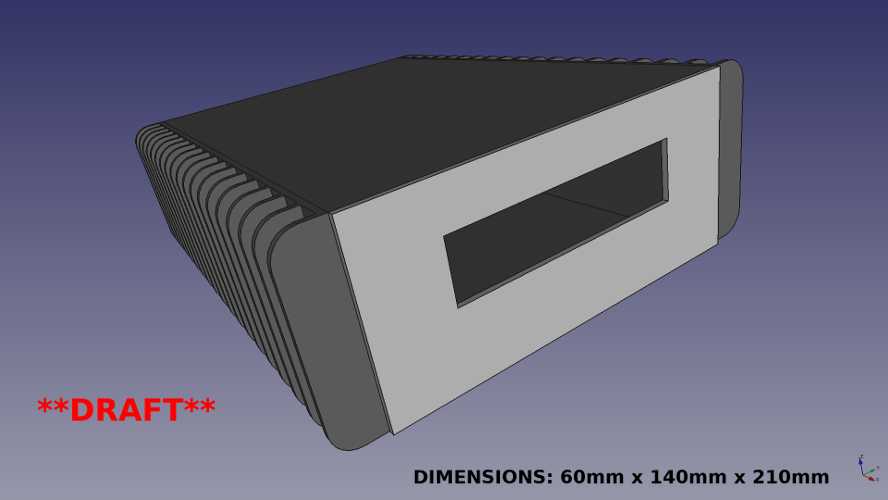
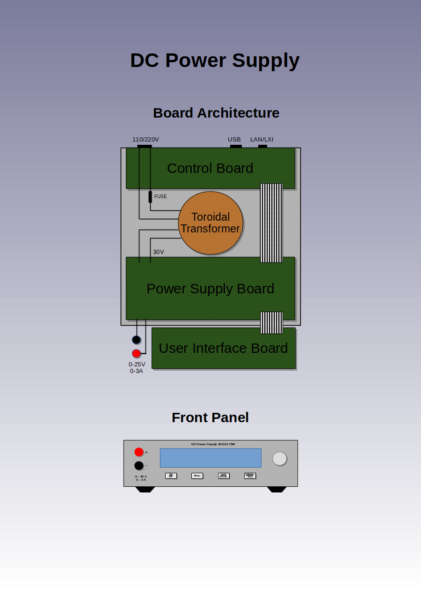
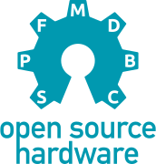

# DC Power Supply

## Description

An open source hardware (OSHW) DC power supply designed using open source tools *(WORK IN PROGRESS)*.

 

## Motivation

This project started as an effort to learn the ins and outs of KiCad because
the author needed to learn how to do a hardware design for a prototype (not
related to this project). However, this side project quickly grew into a thing
of its own. It reflects the ideas and features that the author wishes for a
modern DC power supply.

Also, the world needs a modern compact **fanless** OSHW DC power supply that fits
on the table of every engineer and hacker out there. Lets design one!

Hopefully it can evolve into something which one day will be good enough to be
built and maybe even produced as a kit or product. Or it can simply serve as a
learning experience on how to do OSHW design stuff on GitHub :o)

## Design goals

 - Fanless
 - Compact size
 - Stackable housing
 - Low heat dissipation (high efficiency)
 - Low noise/ripple
 - Minimum component count
 - Simple and responsive UI
 - Beautiful mechanical design
 - Get approved by DaveCad :o)

## Features

 - 0-25V / 0-3A single DC output
 - Dimensions: ~ 60mm x 140mm x 210mm (Height x Width x Depth)
 - Low peak-to-peak voltage (max 25 mVp-p)
 - Constant current (CC)
 - Constant voltage (CV)
 - Hybrid power design
   - Preregulator: Step-down switching regulator (LT8612)
   - Regulator: Linear regulator (LT3081)
 - Precision DC output/multimeter:
   - 1 mV resolution
   - 1 mA resolution
 - AC input voltmeter:
   - 100 mV resolution
 - Large OLED display (256x64) showing:
   - Output voltage
   - Output voltage limit
   - Output current
   - Output current limit
   - Output current limit hit indicator
   - Output power
   - Input voltage (AC)
   - Regulator temperature
   - IP address
 - 4 front panel buttons:
   - On/Off
   - Voltage/Current
   - Menu
   - Lock/Unlock
 - 10/100 Mbps Ethernet port
 - 110V/220V AC input switch (automatic?)
 - Toroidal transformer
 - Replaceable fuse
 - Mains on/off switch
 - Rotary encoder with push button
 - Female banana sockets with standard spacing (19mm)
 - Built in datalogger
   - 64 MB data buffer
   - Up to 1 kHz sampling of:
     - Time
     - Voltage
     - Current
 - Master/slave feature to support higher voltage or current output
   - Link control via ethernet
   - Automatic discovery of potential slaves
   - Example configurations:
     - 25V / 6A (2 units, parallel link)
     - 50V / 3A (2 units, serial link)
     - 25V / 9A (3 units, parallel link)
     - 75V / 3A (3 units, serial link)
 - Powerful MCU (NXP LPC4337)
   - 204 MHz 32-bit Cortex-M4 core
   - 204 MHz 32-bit Cortex-M0 core
 - LXI Core support (HiSlip)
   - Support for SCPI commands to:
     - Turn on/off output
     - Get/set output voltage
     - Get/set output voltage limit
     - Get output current
     - Get/set output current limit
     - Get output power
     - Get regulator temperature
     - Get/set datalogger sampling frequency
     - Start/stop datalogger
     - Dump/clear datalogger buffer
     - Dump screenshot of front display (PNG)
 - IPv4/IPv6 support

## Documentation

 - Available [here](doc)

## Design tools

 - Schematic/PCB design
   - KiCad 4.0.7 (http://kicad-pcb.org)
   - Migrate to KiCad 5.0 when it is released

 - Mechanical design
   - Freecad 0.16.x (https://www.freecadweb.org)

## Assembly considerations

 - Minimum SMD size is 0603 to make it feasible to still hand solder

## Todo

 - Review/refine schematics
   - Add HW ID resistors
   - Add choke
   - Add protection from toroidal inrush current
   - Add AC input voltmeter
   - Add speaker
   - Add resettable fuse (PTC)
   - Add more test points
 - Review/refine PCB layout
   - Split analog and digital ground
   - Make sure tracks are wide enough
   - Minimize parasitics
   - Add more via stitching
   - Add thermal reliefs
 - Add missing KiCad 3D models
 - Rework mechanical design
   - Must be simple and beautiful
   - As compact as possible
   - Sturdy feel
 - MCU firmware
   - Create optimized GCC toolchain (http://crosstool-ng.github.io)
   - Cortex-M4:
     - Handle power control and input/output (buttons, encoder knob, USB,
       display, ethernet/LXI)
   - Cortex-M0:
     - Handle data logging
   - Implement HiSlip protocol (server)
   - Create build system files (Make or Meson)
 - Consider using MCU LPC4367JBD208 variant
   - Adds LCD controller
   - Adds QEI (Quadrature Encoder Interface, for better rotary encoder control)
 - Implement HiSlip protocol (client) in liblxi (https://lxi.github.io)
 - Add missing documentation
 - Create BOM
 - Cost reduction
 - Build a prototype for testing

## Releases

 - Version 0.1 - First release (alpha)

## Milestones

Suggested milestones:

 - Version 1.0 - First stable release (basic features working)
 - Version 2.0 - Feature release (wifi, remote sensing)
 - Version 3.0 - Feature release (2 port LAN switch, automatic power link cable, mains inlet/outlet)

## How to contribute?

This project is fully open source - anyone who wants to contribute is welcome
to get involved.

To get started, simply clone (use 'git clone --recurse-submodules') this
repository and start making your changes.  Once done, do a pull request to push
your changes upstream. Any issues (bugs, suggestions, etc.) can be reported
and/or discussed via the GitHub issue tracker. There is also a GitHub wiki
available for editing. It's the GitHub way!

**Note**: Please take care to always use the latest version of the design tools
to avoid running into compatibility issues.

**Note**: Please take care to try only push incremental changes to avoid big
bang situations.

## License

 This work
is licensed under a <a rel="license"
href="http://creativecommons.org/licenses/by-sa/4.0/">Creative Commons
Attribution-ShareAlike 4.0 International License</a>.

With exception of the firmware which will be released under a BSD-3 license.

##

 
 

